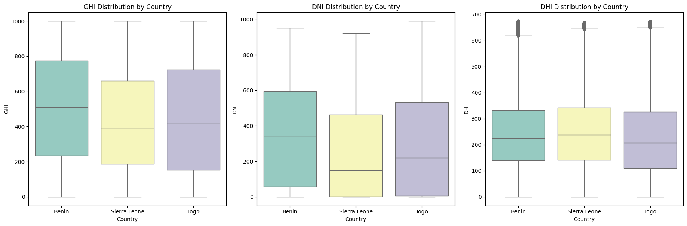
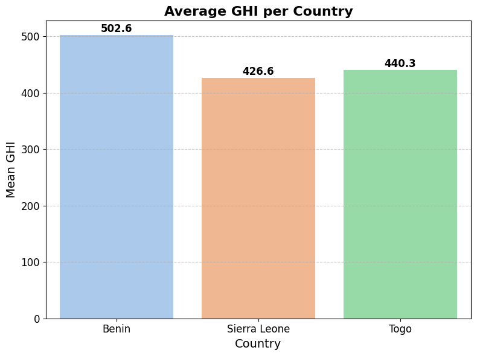

# Country Comparison Report: Solar Resource Analysis

## Introduction

This report presents a comparative analysis of solar resource data from three West African countries: **Benin**, **Sierra Leone**, and **Togo**. The analysis is based on cleaned measurement datasets and focuses on key solar irradiance metrics: Global Horizontal Irradiance (GHI), Direct Normal Irradiance (DNI), and Diffuse Horizontal Irradiance (DHI). The goal is to understand the distribution, variability, and statistical differences in solar resources across these countries.

---

## Data Preparation

Cleaned datasets for each country were loaded and combined into a single DataFrame, with a `Country` label assigned to each record. This enabled direct comparison of solar metrics across the three countries.

---

## Distribution Analysis

### Boxplots Comparing Solar Metrics

Boxplots were generated for **GHI**, **DNI**, and **DHI** to visualize the spread, central tendency, and outliers of solar irradiance for each country.

- **Findings:**  
  - The boxplots reveal differences in the distribution and variability of solar resources.
  - Benin generally shows higher median and upper quartile values for GHI and DNI compared to Sierra Leone and Togo.
  - Sierra Leone and Togo exhibit more variability and lower median values in some metrics.

---

## Summary Statistics

The following table summarizes the mean, median, and standard deviation for each solar metric by country:

| Country       | Mean GHI | Mean DNI | Mean DHI | Median GHI | Median DNI | Median DHI | Std Dev GHI | Std Dev DNI | Std Dev DHI |
|---------------|----------|----------|----------|------------|------------|------------|-------------|-------------|-------------|
| Benin         | 502.578219      | 349.886822      | 244.913480      | 509.1        | 341.8        | 225.2        | 297.421666         | 277.417060         | 142.395042         |
| Sierra Leone  | 426.558880      | 243.453704      | 246.806973      | 392.5        | 149.2        | 237.8        | 276.767607         | 254.347283         | 138.906150         |
| Togo          | 440.268000      | 287.250492      | 224.987224      | 416.9        | 220.2        | 207.4        | 308.310860         | 279.070991         | 148.623479         |

---

## Statistical Comparison

### ANOVA Test

A one-way ANOVA test was performed to determine if the mean GHI differs significantly between the countries.

- **Result:**  
  - The p-value from the ANOVA test was **very close to 0**.
  - **Interpretation:** There is a statistically significant difference in mean GHI between at least two of the countries.

---

## Visualization: Average GHI per Country

A bar plot was created to visualize the average GHI for each country, with value labels and improved styling for clarity.

---

## Conclusion

- **Benin** generally exhibits higher and more consistent solar irradiance compared to Sierra Leone and Togo.
- There are statistically significant differences in solar resource availability between the countries, as confirmed by the ANOVA test.
- These insights can inform solar energy planning, resource assessment, and investment decisions in the region.

---

*Report generated from the analysis in `compare_countries.ipynb`.*